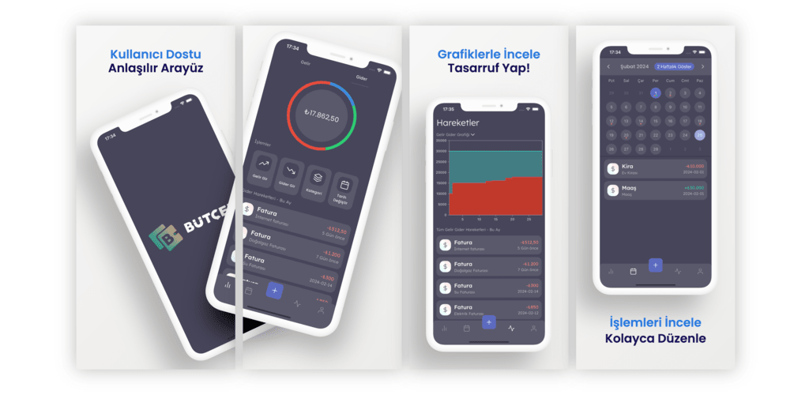

# Merhaba, Ben Bayram! 👋

## Hakkımda 🌟

Merhaba, Ben Bayram Bursa'da yaşıyorum. Geniş Bir deneyime sahip olmakla birlikte, özellikle Javascript alanında uzmanlaştım ve bu alandaki tüm detaylarla ilgileniyorum.

Kariyerim boyunca site tasarlama ve oluşturma konusunda önemli başarılar elde etitm. Kullanıcı deneyimi ve estetik değerlerine vurgu yaparak her proje için çözümler üretmekteyim. Mobil uygulama geliştirme konusunda da derin bir ilgi ve yetenek setine sahibim.

Backend, veritabanı yönetimi ve DevOps alanlarında deneyim kazanmış biriyim ve projelerimde güvenilir ve ölçeklenebilir çözümler sunabilirim. Kodlarım ve projelerimde elde ettiğim başarılar, teknik becerilerime ve mühendislik bakış açıma dayanmaktadır.

Yeni teknolojileri öğrenmek benim için bir tutku ve bu, her projede kendimi daha da geliştirmeme olanak tanıyor. Hızla değişen teknoloji dünyasında güncel kalmak ve son trendleri takip etmek benim için önemli bir prensiptir.

## Dart Programlama E-Book

📘 Dart Programlama E-Book yayında! [dart.bayramalacam.com](https://dart.bayramalacam.com) sitesinde ücretsiz olarak paylaştım! Flutter veya Dart ile ilgileniyorsanız, bu kaynağı kesinlikle incelemelisiniz.

## Blog Yazarıyım

📝 Ayrıca, [bayramalacam.com](https://bayramalacam.com) sitesinde blog yazarlığı yapıyorum! Teknoloji, yazılım geliştirme ve kariyer konularında yazılarımı bulabilirsiniz. Sizlere deneyimlerimden ve öğrendiklerimden bahsetmek benim için bir keyif!

## Sertifikalarım 🏆

- IBM: Application Development using Microservices and Serverless
- IBM: Developing Back-End Apps with Node.js and Express
- IBM: Developing Front-End Apps with React
- IBM: Get Started with Cloud Native, DevOps, Agile, and NoSQL
- IBM: Getting Started with Git and GitHub
- IBM: Introduction to Containers w/ Docker, Kubernetes & OpenShift
- IBM: Introduction to HTML, CSS, & JavaScript
- IBM: Introduction to Software Engineering
- IBM: JavaScript Programming Essentials
- IBM: Software Developer Career Guide and Interview Preparation
- IBM: Software Engineering Essentials
- IBM: Introduction to Cloud Computing
- IBM: Introduction to Cybersecurity Essentials
- IBM: Introduction to Software, Programming, and Databases
- ISC2: Network Security
- Google: Proje Yönetiminin Temelleri
- ISC2: Security Operations
- ISC2: Security Principles
- Fatih Sultan Mehmet Vakıf Üniversitesi: Drone Yapımı ve Kodlama Eğitici Eğitmenliği
- Google Developer Student Clubs Turkey: Flutter Fest Hackathon

## Projelerim 🚀

### Bütçem | Gelir Gider Takip Uygulaması 💰
*Ara 2023 - Halen*
- Kullanıcılara grafiklerle detaylı bir gelir-gider takibi sunar. 📊

[Android](www.bayramalacam.com/budget/android) | [iOS](www.bayramalacam.com/budget/ios)

### Waseat | Karbon Ayak İzi Hesapla 🌍
*Şub 2022*
- Seyahatlerinizi çevre dostu bir şekilde planlamanıza yardımcı olan kullanıcı dostu bir uygulama. 🚗🚲

[Backend](https://github.com/bayramlcm/waseat-backend) | [Mobile](https://github.com/ertugrulsagdic/waseat)

